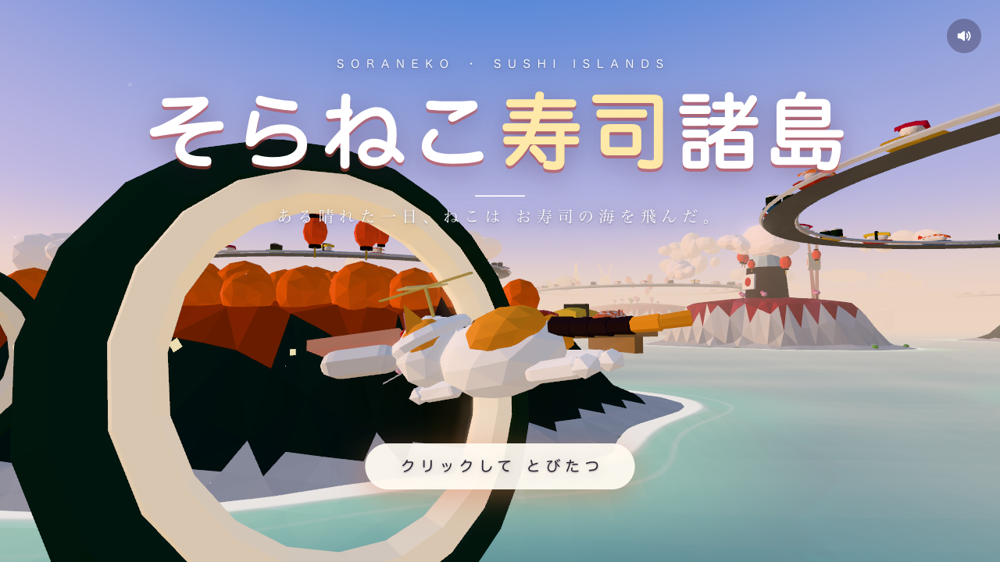
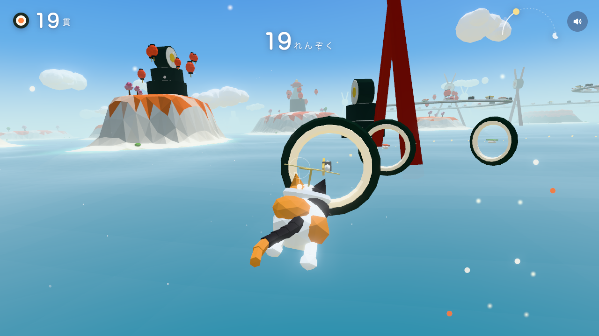
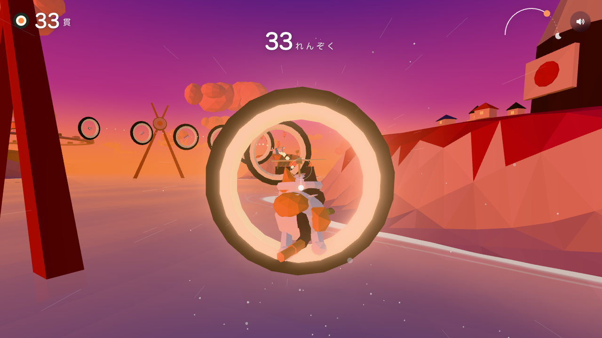

# そらねこ寿司諸島

お題「お寿司の島々を飛ぶ猫」から、Claude Code への **プロンプト1回だけ**（途中の人手の介入なし）で生成した3Dフライトゲーム。生成に使ったプロンプトは [PROMPT.md](PROMPT.md)。





## 遊び方

```sh
python3 -m http.server 8765 --bind 127.0.0.1
# → http://127.0.0.1:8765/
```

- マウスを向けたほうへ飛ぶ。左クリック長押しで加速。キーボード不要
- 巻き寿司のリングをくぐって「貫」を集める。失敗状態なし
- 1フライト = 1日（朝 → 昼 → 夕焼け → 夜、約2分）でリザルトへ

## 構成

- `index.html` + `src/*.js`（ES Modules、ビルド工程なし、約2,900行）
- `vendor/three/` … three.js r170 とポストプロセス一式を同梱。実行時の外部通信なし（オフラインで動く）
- 画像・音声・3Dモデルなどの外部アセットなし。形状はすべてプリミティブの組み合わせ、音はすべて Web Audio API で生成

## デバッグ用パラメータ

| パラメータ | 内容 |
| --- | --- |
| `?autopilot=1` | 自動操縦でリングを追う |
| `?timescale=N` | 1日の進行を N 倍速にする |
| `?quality=0〜3` | 画質を固定（通常は fps に応じて自動調整） |
| `window.__game` | state / score / combo / maxCombo / dayT / timeOfDay / player / fps / quality / audio / `setDay(t)` |

## 検証スクリプト（任意）

Playwright のヘッドレス Chromium で起動・スクリーンショット・操作・音量レベルを確認する。サーバを起動した状態で:

```sh
npm install
npx playwright install chromium
node test/verify.mjs   # スクリーンショットは shots/ に出力
```

## 既知の点

- 通過直後のリングの残像がカメラに被り、画面の大部分を覆う瞬間がある（開始直後・夜・リザルト）
- 音は出力レベルの計測のみで、聴感での確認は生成時点では未実施
- 60fps は Apple M4 Pro での値。重い場合は4段階で自動的に画質が下がる
- 木・家・提灯・回転寿司の皿には当たり判定がなくすり抜ける
- タイトル画面は無音（ブラウザの制約で最初のクリックから音が鳴る）。タッチ操作は未対応
